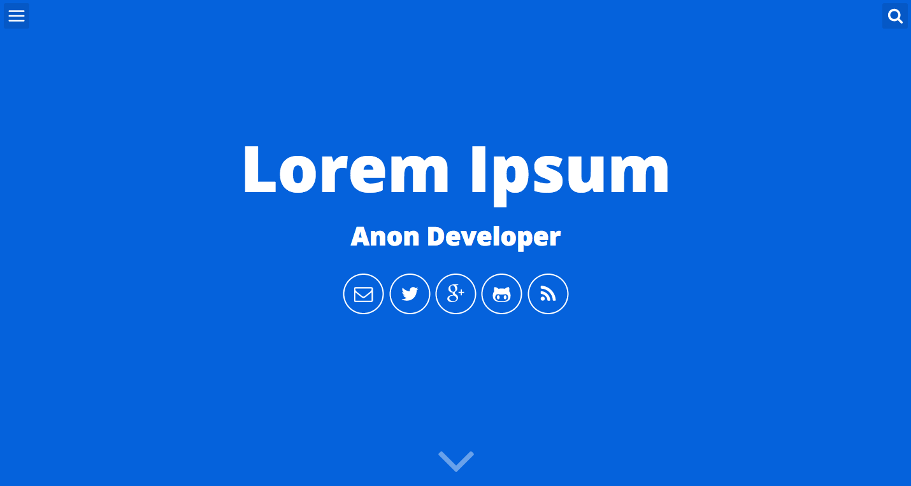

## Will Jekyll Template - [Demo](http://willianjusten.com.br/will-jekyll-template)



Αυτό είναι ένα απλό και μινιμαλιστικό πρότυπο για Jekyll που σχεδιάστηκε για προγραμματιστές που θέλουν να δημοσιεύουν σε blog αλλά δεν τους ενδιαφέρει και πολύ το frontend.

Χαρακτηριστικά του θέματος:

- Gulp
- Stylus (Jeet, Rupture, Kouto Swiss)
- Smoothscroll
- Live Search
- Offcanvas Menu
- Εικονίδια SVG
- Πολύ πολύ μικρό και γρήγορο!
- Shell Script για δημιουργία δημοσιεύσεων
- Σελίδα Tags (ετικετών)
- Σελίδα Series
- Σελιδα About Me (Λίγα λόγια για εμένα)
- Feed RSS
- Sitemap.xml
- Προαρμογή χρωμάτων
- Προσαρογή πληροφοριών

## Βασική εγκατάσταση

1. [Εγκαταστήστε το Jekyll](http://jekyllrb.com) (gem install jekyll bundle)
2. Κάντε Fork την σελίδα [Will Jekyll Template](https://github.com/willianjusten/will-jekyll-template/fork)
3. Μετονομάστε το αποθετήριο από Wll Jekyll Template στην διεύθυνση που θέλετε για την σελίδα σας, πχ **USERNAME.github.io**.
4. Κλωνοποιήστε τοπικά το αποθετήριο που δημιουργήσατε.
5. Επεξεργαστείτε το αρχείο `_config.yml` με τα προσωπικά σας στοιχεία.
6. Ελέγξτε τις δημοσιεύσεις δείγματα στον φάκελο `_posts` για να δείτε παραδείγματα πως εισάγετε κατηγορίες και ετικέτες, και άλλα δεδομένα YAML.
7. Διαβάστε την τεκμηρίωση παρακάτω για επιπλέον προσαρμογή της ιστοσελίδας σας.
8. **Θυμηθείτε να μεταγλωττίσετε τα αρχεία με την εντολή Gulp.** Σε περίπτωση που δεν υπάρχει, εγκαταστήστε την.

## Ρυθμίσεις ιστοσελίδας και χρήστη

Πρέπει να συμπληρώσετε κάποιες πηροφορίες στο αρχείο `_config.yml` για να προσαρμόσετε την ιστοσελίδα.

```
# Ρυθμίσεις ιστοσελίδας
description: iBlog Efstathios Iosifidis
baseurl: "" # ο υποφάκελος της σελίδας σας, π.χ. /blog/. Εάν θέλετε να είναι στο ριζικό κατάλογο, αφήστε το κενό 
url: "http://USERNAME.github.io" # Η βασική διεύθυνση της σελίδας σας 

# User settings
username: Efstathios Iosifidis
user_description: iBlog Efstathios Iosifidis
user_title: iBlog
email: anon@anon.com
twitter_username: eiosifidis
github_username:  iosifidis
gplus_username:  +EfstathiosIosifidis
disqus_username: iblog-eiosifidis #Θα δηλώσετε το site σας στο https://disqus.com/features/.Πρέπει να βάλετε ως όνομα χρήστη, το όνομα του disqus που δημιουργήσατε.
```

**Μην ξεχάσετε να αλλάξετε την βασική διεύθυνση (baseurl) πριν "χτίσετε" την ιστοσείδα σας!**

## Προσαρμογή χρωμάτων

Όλες οι μεταβλητές των χρωμάτων είναι στο `src/styl/variable`. Για να αλλάξετε το κυρίως χρώμα, απλά αλλάξτε την τιμή στην μεταβλητή `main` (το δικό μου είναι #3b5998). Τα υπόλοιπα χρώματα αφορούν τα κείμενα και το χρώμα φόντου.

## Δημιουργία δημοσιεύσεων

Μπορείτε να χρησιμοποιήσετε την εντολή `initpost.sh` για να δημιουργήσετε νέες δημοσιεύσεις. Ολοκληρωμένη η εντολή είναι:

```
./initpost.sh -c Post Title
```

Αυτό θα δημιουργήσει μια δημοσίευση στο `_posts` με την διαμόρφωση `date-title.md`. Η ολοκληρωμένη διεύθυνση θα είναι http://USERNAME.github.io/title. Οπότε προσέξτε τι τίτλο γράφετε.

## Εμφάνιση δημοσίευσης 

Όταν δημιουργήσετε νέα δημοσίευση, θα χρειαστεί να συμπληρώσετε πληροφορίες για την εμφάνιση. Ακολουθήστε το παράδειγμα:

```
---
layout: post
title: "How to use"
date: 2015-08-03 03:32:44
image: '/assets/img/post-image.png'
description: 'First steps to use this template'
tags:
- jekyll 
- template 
categories:
- I love Jekyll
twitter_text: 'How to install and use this template'
---
```

## Εκτέλεση της σελίδας τοπικά

Για να μεταγλωττίσετε την σελίδα και να δείτε το αποτέλεσμα πρέπει να ακολουθήσετε τα παρακάτω βήματα:

- Εγκαταστήστε το [NodeJS](https://nodejs.org/)
- Μέσα στον φάκελο που δουλεύετε, εκτελέστε `npm install` 
- Μέσα στον φάκελο που δουλεύετε, εκτελέστε `gulp`. Σε περίπτωση που δεν υπάρχει, εγκαταστήστε την.
- Ανεβάστε την σελίδα στο github.

## Ερωτήσεις

Έχετε πρόβλημα να δουλέψει κάτι ή ερώτηση γατί έχω συντάξει κάτι με αυτόν τρόπο; Βρείτε με στο Twitter [@willian_justen](https://twitter.com/willian_justen) ή στείλτε ένα [GitHub Issue](https://github.com/willianjusten/will-jekyll-template/issues/new).

## Άδεια χρήσης

This theme is free and open source software, distributed under the The MIT License. So feel free to use this Jekyll theme on your site without linking back to me or using a disclaimer.

If you’d like to give me credit somewhere on your blog or tweet a shout out to [@willian_justen](https://twitter.com/willian_justen), that would be pretty sweet.


